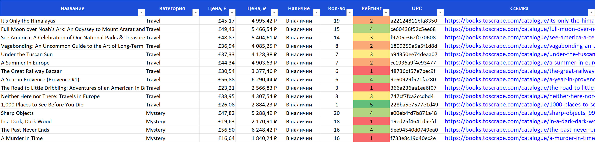
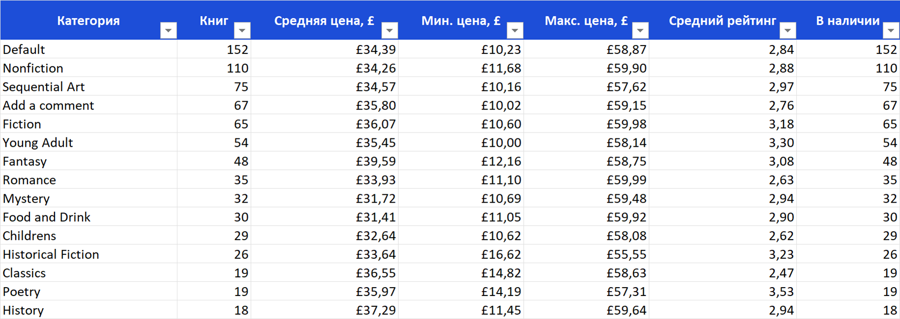

# Парсер каталога книг → Excel / Google Таблица

> **Демо-проект для портфолио.** Источник — [books.toscrape.com](https://books.toscrape.com/),
> учебный сайт, созданный специально для практики парсинга.

## Задача

Собрать весь каталог интернет-магазина в аккуратную таблицу: название, категория, цена, наличие, рейтинг, ссылка.
Запуск — одной командой, с выбором категорий и числа страниц. Парсер не должен падать от одной битой страницы
и должен понятно сообщать, что пошло не так.

## Что умеет

- Обходит все 50 категорий и пагинацию внутри каждой — **1000 книг**.
- Режим `--details`: заходит на страницу каждой книги и добавляет **количество на складе, артикул (UPC) и описание**.
- Переводит цену в рубли **по курсу ЦБ РФ** на день запуска.
- Сохраняет **Excel** с тремя листами:
  - «Книги» — синяя закреплённая шапка, фильтры, форматы цен, цветовая шкала рейтинга, кликабельные ссылки;
  - «Сводка» — по каждой категории: сколько книг, средняя/мин/макс цена, средний рейтинг, сколько в наличии;
  - «Параметры» — когда и с какими настройками запускали, сколько запросов, ошибок и времени.
- Опционально пишет то же самое в **Google Таблицу** (`--gsheet`).
- Надёжность:
  - пауза между запросами (по умолчанию 0,5 с) — не нагружает сайт;
  - автоповтор запроса при обрыве связи и ошибках сервера (3 попытки с растущей паузой);
  - битая страница или карточка не останавливает сбор — ошибка пишется в лог и в итоговую сводку;
  - **Ctrl+C** не теряет данные: всё собранное к этому моменту сохраняется в файл.
- Понятные сообщения: нет интернета, опечатка в категории (подскажет похожие), не настроена Google Таблица.
- Лог в консоль и в файл `logs/parser.log` (файл не разрастается: ротация по 1 МБ).

## Стек

Python 3.12, requests, BeautifulSoup + lxml, openpyxl, gspread, python-dotenv.

## Пример результата

1000 книг, режим `--details`, 0 ошибок, 10,5 минуты:

- 📊 **[Открыть в браузере (Google Диск)](https://docs.google.com/spreadsheets/d/1Xj-IE13vY2cw67yFVt-CjLdBSaisGFTt/edit?usp=sharing)**
- 📥 [Скачать .xlsx](docs/books_example.xlsx)





## Установка и запуск (Windows, PowerShell)

```powershell
git clone https://github.com/sigutailya-sketch/books-parser.git
cd books-parser
.\run.ps1
```

При первом запуске `run.ps1` сам создаст виртуальное окружение и установит библиотеки.
Готовый файл появится в папке `output/`.

<details>
<summary>Установка вручную (Windows / Linux / macOS)</summary>

```bash
python -m venv .venv
.venv\Scripts\activate          # Linux/macOS: source .venv/bin/activate
pip install -r requirements.txt
python parser.py
```
</details>

### Параметры

| Параметр | Что делает |
|---|---|
| `-c`, `--category НАЗВАНИЕ` | только эта категория; можно указать несколько раз |
| `-p`, `--pages N` | не больше N страниц в каждой категории (20 книг на странице) |
| `-d`, `--delay СЕК` | пауза между запросами, по умолчанию 0.5 |
| `--details` | заходить на страницу каждой книги (количество, UPC, описание) |
| `-o`, `--output ФАЙЛ` | куда сохранить .xlsx |
| `--gsheet` | дополнительно записать в Google Таблицу |
| `--list-categories` | показать список категорий |
| `-v`, `--verbose` | подробный вывод |

### Примеры

```powershell
.\run.ps1 --list-categories                 # какие есть категории
.\run.ps1 -c Mystery -c Poetry              # две категории
.\run.ps1 -c Travel --details               # с количеством на складе и описанием
.\run.ps1 --pages 1 --delay 1               # быстрый пробный прогон: по странице в категории
.\run.ps1 --details --gsheet                # весь каталог в Excel и в Google Таблицу
```

Пример вывода:

```
22:06:13  INFO    Старт: категорий 2, страниц на категорию: все, пауза 0.5 с, с деталями
22:06:15  INFO    Poetry: страница 1/1, книг на странице: 19
22:06:35  INFO    Travel: страница 1/1, книг на странице: 11
22:06:44  INFO    Excel сохранён: ...\output\books_2026-10-01_22-06.xlsx
22:06:44  INFO    Готово: 30 книг за 32 с, ошибок: 0. Подробный лог: ...\logs\parser.log
```

Опечатка в категории:

```
ERROR   Категория «Mistery» не найдена. Возможно, вы имели в виду: Mystery, History.
```

## Google Таблицы

Парсер пишет в таблицу от имени **сервисного аккаунта** Google — это «робот» с собственным e-mail,
которому вы даёте доступ к одной конкретной таблице. Пароль от вашего аккаунта не нужен.

1. Откройте [Google Cloud Console](https://console.cloud.google.com/) → создайте проект.
2. **APIs & Services → Library** → включите **Google Sheets API** и **Google Drive API**.
3. **APIs & Services → Credentials → Create credentials → Service account** → создайте аккаунт.
4. Откройте созданный аккаунт → **Keys → Add key → Create new key → JSON**. Скачанный файл положите
   в папку проекта как `credentials.json` (в репозиторий он не попадёт — см. `.gitignore`).
5. Создайте пустую Google Таблицу и нажмите **«Настройки доступа»** → добавьте e-mail сервисного аккаунта
   (вида `…@….iam.gserviceaccount.com`) с правами **«Редактор»**.
6. Скопируйте `.env.example` в `.env` и впишите `GSHEET_ID` — часть ссылки на таблицу между `/d/` и `/edit`.
7. Запуск: `.\run.ps1 --gsheet`.

## Структура

```
parser.py       — запуск и параметры командной строки, логирование, сохранение
scraper.py      — загрузка страниц, разбор HTML, повторы запросов, курс ЦБ
exporters.py    — выгрузка в Excel (оформление, сводка) и в Google Таблицу
run.ps1         — запуск одной командой в PowerShell
.env.example    — шаблон настроек Google Таблицы
docs/           — пример результата и скриншоты
```

## Как адаптировать под другой сайт

Вся работа с разметкой собрана в `scraper.py`: CSS-селекторы карточки, цены, пагинации.
Под новый сайт меняются селекторы и поля `Book`, выгрузка в Excel/Google Таблицу остаётся как есть.
